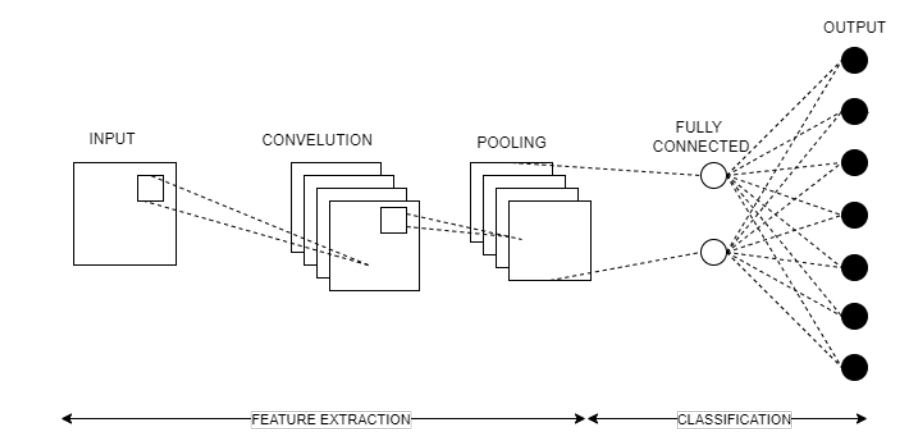

# EMOTION DETECTION

A CNN Based Human Emotion Detection System. 


## Installation

Install python libraries for the project

```bash
  pip install opencv-python
      
  pip install tensorflow
```

### For Traing The model
Collect The Images From kaggle

```bash
https://www.kaggle.com/datasets/deadskull7/fer2013
```
Then Run
```bash
facial-emotion-recognition.ipynb
```

### For Testing

Just Run
```bash
face_emotion_run.py
```
Don't Forget to add the haarcascade file in testing file


## Architecture



## Result


#### Thank You...!

